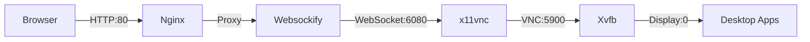

<div align="center">

# 𓄿 RAVEN

### <strong>R</strong>emote <strong>A</strong>ccess <strong>V</strong>irtual <strong>E</strong>nvironment <strong>N</strong>ode

[](https://www.docker.com/)
[](https://ubuntu.com/)
[](LICENSE)
[](https://novnc.com/)
[](https://developer.nvidia.com/cuda-toolkit)

**GPU accelerated Ubuntu desktop in the browser for AI and development workflows**

[Features](#-features) • [Quick Start](#-quick-start) • [Architecture](#-architecture) • [GPU Support](#-gpu-support) • [Configuration](#-configuration) • [Advanced Usage](#-advanced-usage) • [Troubleshooting](#-troubleshooting)

</div>

---

## 📖 Overview

**RAVEN** is a high-performance, containerized desktop environment built on Ubuntu LTS. It provides a complete **LXDE** desktop accessible through any modern web browser via **noVNC**, eliminating the need for local VNC client software.

RAVEN is engineered for:

- 💻 **Remote Development**: A consistent, pre-configured environment for teams.
- 🤖 **AI/ML Workflows**: Native GPU support and auto-detected CUDA environments.
- �� **GUI Testing**: Headless X11 framebuffer for CI/CD pipelines.
- ☁️ **Cloud Workstations**: Lightweight desktop access on remote servers.

### ✨ What's New in v2.0?

- 🚀 **Auto-Detected CUDA**: Intelligent startup scripts that detect and configure CUDA environments automatically.
- 🎯 **Persistent GPU Support**: Environment variables that persist across all interactive shells and supervised processes.
- 📦 **Flexible Base Images**: Support for Ubuntu 20.04, 22.04, and 24.04 via simple [Dockerfile customization](#-customizing-the-ubuntu-base-image).
- 🔊 **Audio Integration**: ALSA support for audio-enabled applications.
- 📝 **Technical Documentation**: Comprehensive guides for GPU binding and troubleshooting.

### 🎯 Why RAVEN?

- ✅ **Zero Client Setup**: Access your full desktop from any browser (Chrome, Firefox, Safari, Edge).
- ✅ **Docker Native**: Designed specifically for container orchestration and cloud-native deployments.
- ✅ **GPU Ready**: Automatic NVIDIA CUDA detection with persistent environment configuration.
- ✅ **Developer Focused**: Pre-installed Python (Conda + UV), Brave Browser, and essential build tools.
- ✅ **Production Stable**: Process supervision via **Supervisor** with automatic service recovery.
- ✅ **Lightweight**: Optimized resource usage with the LXDE desktop environment.

---

## 🚀 Features

### 🖥️ Desktop Environment

- **Full Linux Desktop**: Powered by **LXDE** (Openbox + PCManFM) for a lightweight, responsive GUI.
- **Modern Theming**: Pre-configured with Arc-Dark theme, Papirus icons, and Ubuntu wallpapers.
- **Window Management**: Smooth multi-window operations via Openbox.
- **File Management**: Intuitive file operations with PCManFM.

### 🌐 Remote Access

- **Browser-Based Access**: Powered by **noVNC (v1.6.0)** - no client installation required.
- **Security**: Password-protected VNC sessions with configurable authentication.
- **Reverse Proxy**: Integrated **Nginx** for clean HTTP access on port 80.
- **Cross-Platform**: Fully responsive interface works on desktop, tablet, and mobile browsers.

### 🛠️ Development Tools

- **Brave Browser**: Secure, fast web development and testing.
- **Python Stack**: **Miniconda3** for environment management and **uv** for blazing-fast package installation.
- **Build Essentials**: GCC, G++, CMake, Ninja, and Git pre-installed.
- **VS Code Ready**: Optimized for remote development (Official Microsoft build).

### ⚙️ System Features

- **GPU Acceleration**: Automatic NVIDIA CUDA detection and configuration.
- **Audio System**: ALSA (Advanced Linux Sound Architecture) integration.
- **Optimized Image**: Multi-stage Docker build for reduced image size.
- **Process Supervision**: Automatic recovery of crashed services via Supervisor.
- **Logging**: Comprehensive service logs available in `/var/log/supervisor/`.

---

## 🏗️ Architecture

RAVEN uses a **decomposed desktop architecture** managed by Supervisor to ensure stability and automatic recovery. Unlike traditional LXDE setups that use `startlxde`, RAVEN launches each component independently to prevent Docker PID conflicts and ensure granular control.

### Service Stack

| Priority | Service | Port | Description |
| --------- | --------- | ------ | ------------- |
| **10** | **Xvfb** | - | Virtual X11 display server (headless framebuffer) |
| **20** | **Openbox** | - | Lightweight window manager for UI rendering |
| **21** | **LXPanel** | - | Taskbar and application menu |
| **22** | **PCManFM** | - | File manager, desktop icons, and wallpaper handler |
| **30** | **x11vnc** | 5900 | VNC server exposing the virtual display |
| **40** | **Websockify** | 6080 | WebSocket bridge for browser compatibility |
| **50** | **Nginx** | 80 | HTTP reverse proxy serving the noVNC interface |

### Data Flow



---

## 📦 Quick Start

### Prerequisites

- **Docker** 20.10+ installed on your host system.
- (Optional) **NVIDIA Container Toolkit** for GPU acceleration.
- **4GB+ RAM** recommended for optimal performance.
- **Modern web browser** (Chrome, Firefox, Safari, Edge).

### 1️⃣ Get the Image

#### Option A: Pull Pre-built Image (Recommended)

The pre-built image is the fastest way to get started and is kept in sync with the current codebase.

```bash
# Pull the latest stable image
docker pull sarkarsaswata001/raven_personal:v0

# Tag it for convenience
docker tag sarkarsaswata001/raven_personal:v0 raven-desktop:latest
```

*Download size: ~3.5GB | Estimated time: 2-5 minutes*

#### Option B: Build from Source

Build the image locally if you need to customize the base OS or pre-installed packages.

```bash
git clone https://github.com/yourusername/raven.git
cd raven
docker build -t raven-desktop:latest .
```

### 2️⃣ Run the Container

#### Basic Usage

```bash
docker run -d --name raven \
  -p 80:80 \
  -p 5900:5900 \
  -e VNC_PASSWORD=YourSecurePassword123 \
  --shm-size=2g \
  raven-desktop:latest
```

#### With GPU Support (Recommended for AI/ML)

```bash
docker run -d --name raven \
  --gpus all \
  -p 80:80 \
  -e VNC_PASSWORD=YourSecurePassword123 \
  --shm-size=2g \
  raven-desktop:latest
```

#### Full Configuration (GPU + Audio + Workspace)

```bash
docker run -d --name raven \
  --gpus all \
  -p 80:80 \
  -p 5900:5900 \
  --device /dev/snd \
  -e VNC_PASSWORD=YourSecurePassword123 \
  -e RESOLUTION=1920x1080 \
  -v $(pwd)/workspace:/workspace \
  --shm-size=2g \
  raven-desktop:latest
```

> **⚠️ Important:** Always set `--shm-size` to at least **2g**. Modern browsers (Brave/Chrome) use shared memory for rendering; insufficient memory will cause "Aw, Snap!" crashes.

### 3️⃣ Access the Desktop

1. Open your browser and navigate to `http://localhost`.
2. Enter your `VNC_PASSWORD` (default: `changeme`).
3. You are now inside your RAVEN desktop environment!

---

## ⚙️ Configuration

### Environment Variables

| Variable | Default | Description |
| --- | --- | --- |
| `VNC_PASSWORD` | `changeme` | Password for VNC authentication |
| `RESOLUTION` | `1920x1080` | Virtual screen resolution (WxH) |
| `DISPLAY` | `:0` | X11 display identifier |
| `ALSADEV` | `hw:0,0` | ALSA audio device identifier |

### Port Mapping

| Container Port | Protocol | Purpose |
| ------------- | --------- | -------- |
| `80` | HTTP | noVNC web interface (via Nginx) |
| `5900` | VNC | Raw VNC protocol for external clients |
| `6080` | WebSocket | noVNC WebSocket bridge (Websockify) |

---

## 🎮 GPU Support

RAVEN v2.0 features an intelligent GPU integration system that handles CUDA configuration automatically.

### 🚀 CUDA Auto-Detection

When the container starts, the `startup.sh` script:

1. Scans `/usr/local/` for CUDA installations (e.g., `cuda-12.8`).
2. Automatically generates `/etc/profile.d/cuda.sh`.
3. Configures `PATH` and `LD_LIBRARY_PATH` for all shells.

**Verify your GPU setup:**

```bash
docker exec -it raven bash
nvcc --version
nvidia-smi
```

### 🛠️ Host CUDA Binding (Advanced)

If you prefer to use your host's CUDA installation instead of installing it in the container:

```bash
docker run -d --name raven \
  --gpus all \
  -v /usr/local/cuda-12.8:/usr/local/cuda-12.8:ro \
  -v /usr/local/cuda:/usr/local/cuda:ro \
  raven-desktop:latest
```

*Note: Ensure you bind both the versioned directory and the `/usr/local/cuda` symlink for maximum compatibility.*

---

## 🔧 Advanced Usage

### Managing Services

RAVEN uses **Supervisor** to manage all desktop components. You can check service status or restart components without restarting the container.

```bash
# Check status of all services
docker exec raven supervisorctl status

# Restart a specific service (e.g., the window manager)
docker exec raven supervisorctl restart openbox
```

### Accessing Logs

All service logs (stdout and stderr) are stored in `/var/log/supervisor/`.

```bash
# View Xvfb errors
docker exec raven cat /var/log/supervisor/xvfb.err.log

# Tail Nginx logs
docker exec raven tail -f /var/log/supervisor/nginx.out.log
```

### Customizing the Ubuntu Base Image

You can easily change the Ubuntu version by modifying the `FROM ubuntu:...` instruction in the `Dockerfile`:

```dockerfile
# Example: Switch to Ubuntu 24.04 LTS
FROM ubuntu:24.04
```

*See the [Technical FAQ](#-faq) for version-specific considerations.*

---

## 🐛 Troubleshooting

### Black Screen in Browser

- **Cause**: Xvfb or Openbox failed to start.
- **Fix**: Check `supervisorctl status`. If `xvfb` is `FATAL`, check `/var/log/supervisor/xvfb.err.log`. Usually caused by a stale X11 lock file in `/tmp/.X11-unix/`.

### Browser "Aw, Snap!" Crashes

- **Cause**: Insufficient shared memory.
- **Fix**: Ensure you started the container with `--shm-size=2g`.

### `nvcc: command not found`

- **Cause**: CUDA paths not sourced or mount failed.
- **Fix**: Run `source /etc/profile.d/cuda.sh`. If using host binding, verify the mount path with `ls /usr/local/cuda`.

---

## 🔒 Security Considerations

1. **VNC Password**: Never run RAVEN in a public environment with the default `changeme` password.
2. **Network**: If exposing port 80 to the internet, use a reverse proxy (like Traefik or Nginx Proxy Manager) with SSL/TLS.
3. **Privileges**: Avoid running the container with `--privileged` unless absolutely necessary for specific hardware access.

---

## ❓ FAQ

**Q: Can I run this in Kubernetes?**  
A: Yes. Use a Deployment and expose port 80 via a Service or Ingress. For GPU support, ensure your nodes have the NVIDIA Device Plugin installed.

**Q: How do I save my work?**  
A: Use Docker volumes. Mount a host directory to `/workspace` in the container: `-v /path/on/host:/workspace`.

**Q: Is audio supported?**  
A: Yes, via ALSA. Use `--device /dev/snd` and ensure your host audio drivers are compatible.

---

## 🤝 Contributing

Contributions are welcome! Please see our [Contributing Guidelines](CONTRIBUTING.md) for details on our code of conduct and the process for submitting pull requests.

---

## ⚖️ License

RAVEN is licensed under the **Apache License 2.0**. See [LICENSE](LICENSE) for full details.

<div align="center">

**Built with ❤️ for the developer community**

[⬆ Back to Top](#-raven)

</div>
