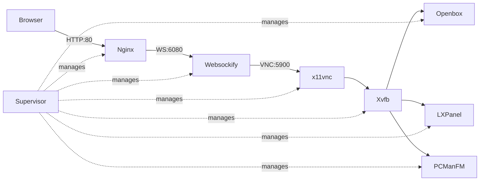

<div align="center">

# 𓄿 RAVEN

## Remote Access Virtual Environment Node

[](https://www.docker.com/)
[](https://ubuntu.com/)
[](LICENSE)
[](https://novnc.com/)

GPU-accelerated Ubuntu desktop accessible via browser. LXDE, noVNC, automatic CUDA detection, Supervisor-managed services.

[Quick Start](#quick-start) • [User-Agnostic Workflow](#user-agnostic-file-ownership-developer-workflow) • [GPU Support](#gpu-support) • [Configuration](#configuration) • [Troubleshooting](#troubleshooting)

</div>

---

## Overview

Containerized Ubuntu 22.04 LXDE desktop with browser-based access via noVNC. Designed for remote development, AI/ML workflows, GUI testing, and cloud workstations.

**Key capabilities:**

- LXDE desktop (Openbox, PCManFM, LXPanel) with Arc-Dark theme
- noVNC 1.6.0 + Nginx reverse proxy on port 80
- Automatic CUDA toolkit detection and PATH configuration
- Miniconda3, uv package manager, Brave browser
- Supervisor process management with auto-recovery
- ALSA audio support

---

## Architecture

Supervisor-managed decomposed desktop:



| Service | Port | Function |
| --------- | ------ | ---------- |
| Nginx | 80 | HTTP proxy for noVNC |
| Websockify | 6080 | WebSocket bridge (internal) |
| x11vnc | 5900 | VNC server |
| Xvfb/Openbox | - | Display server + window manager |

---

## Quick Start

**Requirements:** Docker, 4GB+ RAM. NVIDIA Container Toolkit for GPU support.

### Pull Image

```bash
docker pull sarkarsaswata001/raven-desktop:latest
```

### Run

**CPU-only:**

```bash
docker run -d --name raven \
  -p 80:80 -p 5900:5900 \
  -e VNC_PASSWORD=YourSecurePassword123 \
  -e HOST_UID=$(id -u) \
  -e HOST_GID=$(id -g) \
  -e HOST_USER=$(whoami) \
  --shm-size=2g \
  raven-desktop:latest
```

#### GPU (auto CUDA detect)

```bash
docker run -d --name raven \
  --gpus all \
  -p 80:80 -p 5900:5900 \
  -e VNC_PASSWORD=YourSecurePassword123 \
  -e HOST_UID=$(id -u) \
  -e HOST_GID=$(id -g) \
  -e HOST_USER=$(whoami) \
  --shm-size=2g \
  -v /usr/local/cuda-12.8:/usr/local/cuda-12.8:ro \
  -v /usr/local/cuda:/usr/local/cuda:ro \
  raven-desktop:latest
```

#### GPU + Audio + Workspace

```bash
docker run -d --name raven \
  --gpus all \
  -p 80:80 -p 5900:5900 \
  --device /dev/snd \
  -e VNC_PASSWORD=YourSecurePassword123 \
  -e HOST_UID=$(id -u) \
  -e HOST_GID=$(id -g) \
  -e HOST_USER=$(whoami) \
  -e RESOLUTION=1920x1080 \
  -v /path/on/host:/workspace \
  --shm-size=2g \
  raven-desktop:latest
```

#### Multi-instance / custom ports / extra mounts

```bash
docker run -d --name raven \
  --gpus all \
  -p 8082:80 -p 9092:5900 \
  --device /dev/snd \
  -e VNC_PASSWORD=YourSecurePassword123 \
  -e HOST_UID=$(id -u) \
  -e HOST_GID=$(id -g) \
  -e HOST_USER=$(whoami) \
  -e RESOLUTION=1920x1080 \
  -v /path/on/host:/workspace \
  -v /path/on/host/subdir1:/workspace/subdir1 \
  -v /path/on/host/subdir2:/workspace/subdir2 \
  -v /usr/local/cuda-12.8:/usr/local/cuda-12.8:ro \
  -v /usr/local/cuda-11.8:/usr/local/cuda-11.8:ro \
  -v /usr/local/cuda-13.0:/usr/local/cuda-13.0:ro \
  -v /usr/local/cuda:/usr/local/cuda:ro \
  --shm-size=2g \
  raven-desktop:latest
```

> **⚠️ Use `--shm-size >= 2g`** to avoid browser “Aw, Snap!” crashes.
> **🔑 User Identity Matching (CRITICAL):** The environment variables `HOST_UID`, `HOST_GID`, and `HOST_USER` ensure files created inside the container appear on the host with correct ownership. **Always include these**—without them, you'll get permission conflicts when editing files in VS Code. See [User-Agnostic Workflow](#user-agnostic-file-ownership-developer-workflow) for details.
>
### 3️⃣ Access the Desktop

1. Open `http://localhost` (or your mapped port, e.g., `http://localhost:8082`).
2. Enter the `VNC_PASSWORD` you set at `docker run`.
3. You’re in the RAVEN desktop.

---

## User-Agnostic File Ownership (Developer Workflow)

This container is designed to work seamlessly with your host user, preventing the common issue where `docker exec` commands create files owned by root, making them uneditable in VS Code.

### How It Works

1. **Container Startup:** When the container boots, `startup.sh` automatically claims `/workspace` for your host user (via `HOST_UID` and `HOST_GID`).
2. **File Creation:** Any files you create inside the container will inherit the correct permissions, matching your host user.
3. **VS Code Integration:** Edit files directly in VS Code without permission issues—no `sudo` required.

### Development Workflow

#### **Starting the Container**

Always pass your local identity when starting the container:

```bash
docker run -d --name raven \
  -e HOST_UID=$(id -u) \
  -e HOST_GID=$(id -g) \
  -e HOST_USER=$(whoami) \
  -v /path/to/codebase:/workspace \
  raven-desktop:latest
```

#### **Interactive Development (Bash/Shell)**

To ensure files created by `uv init`, `uv venv`, `git clone`, or other tools are owned by your host user, **always exec as your host user**, not root:

```bash
# ✅ CORRECT: Execute as host user
docker exec -it --user $(whoami) raven bash

# ✅ ALSO CORRECT: Execute as specific host user by name
docker exec -it --user myusername raven bash
```

Inside this shell, commands like these create files with the correct ownership:

```bash
# Create virtual environment (files owned by host user)
uv venv

# Initialize new project (correct file permissions)
uv init my-project

# Clone repository (no permission conflicts after exit)
git clone https://github.com/user/repo.git

# Edit with terminal editors (no sudo required back on host)
nano pyproject.toml
```

#### **Why This Matters**

Without matching user IDs, you'd get this problem:

```bash
# ❌ BAD: Files created as root
docker exec raven bash -c "uv init myproject"
# Result: Files owned by root:root, uneditable in VS Code

# ✅ GOOD: Files match host user
docker exec -it --user $(whoami) raven bash -c "uv init myproject"
# Result: Files owned by $USER:$GROUP, fully editable in VS Code
```

### Verification

Check that ownership is correct:

```bash
# On host machine
ls -la /path/to/codebase/
# Expected: drwxr-xr-x  user  group  4096  Jan 2 10:30 .venv
#           -rw-r--r--  user  group  1234  Jan 2 10:30 pyproject.toml
```

---

## Configuration

**Environment Variables:**

| Variable | Default | Description |
| ---------- | --------- | ------------- |
| `VNC_PASSWORD` | `changeme` | VNC authentication password |
| `RESOLUTION` | `1920x1080` | Screen resolution (WxH) |
| `CUDA_VERSION` | - | Select specific CUDA version (e.g., `12.8`) |
| `HOST_UID` | `1000` | **[CRITICAL]** User ID for workspace file ownership. Set to `$(id -u)` to match your host user. |
| `HOST_GID` | `1000` | **[CRITICAL]** Group ID for workspace file ownership. Set to `$(id -g)` to match your host group. |
| `HOST_USER` | `dev` | **[CRITICAL]** Username for workspace file ownership. Set to `$(whoami)` to match your host username. |
| `DISPLAY` | `:0` | X11 display identifier |
| `ALSADEV` | `hw:0,0` | ALSA audio device |

**Ports:**

| Port | Purpose                             |
|------|-------------------------------------|
| 80   | noVNC web interface (HTTP)          |
| 5900 | VNC protocol (direct client access) |

---

## GPU Support

### 🚀 CUDA Auto-Detection

When the container starts, the [`startup.sh`](startup.sh) script:

1. Scans `/usr/local/` for CUDA installations (e.g., `cuda-12.8`).
2. Automatically generates `/etc/profile.d/cuda.sh`.
3. Configures `PATH` and `LD_LIBRARY_PATH` for all shells.

**Verify your GPU setup:**

```bash
docker exec -it raven bash
nvcc --version
nvidia-smi
```

### 🎚️ Choosing How CUDA Appears

- **Host bind (small image, flexible):** Mount full toolkits: `-v /usr/local/cuda-12.8:/usr/local/cuda-12.8:ro -v /usr/local/cuda:/usr/local/cuda:ro`. Optional `CUDA_VERSION=13.0` (or `12.8`, etc.) chooses a mounted version; otherwise the highest nvcc-capable mount wins. Without mounts, `nvcc` will not exist.
- **Bake CUDA (no binds required):** If you want `-e CUDA_VERSION=12.8` to “just work” with no mounts, base the image on a CUDA *devel* variant (e.g., `FROM nvidia/cuda:12.8.0-devel-ubuntu22.04`) or apt-install the toolkit inside the Dockerfile. Then the env just selects which baked-in version to expose on `PATH`.

### 🛠️ Host CUDA Binding (Advanced)

If you prefer to use your host's CUDA installation instead of installing it in the container:

```bash
docker run -d --name raven \
  --gpus all \
  -v /usr/local/cuda-12.8:/usr/local/cuda-12.8:ro \
  -v /usr/local/cuda:/usr/local/cuda:ro \
  raven-desktop:latest
```

*Note: Ensure you bind both the versioned directory and the `/usr/local/cuda` symlink for maximum compatibility.*

---

## Advanced

**Service management:**

```bash
docker exec raven supervisorctl status              # Check all services
docker exec raven supervisorctl restart openbox     # Restart component
```

**Logs:** Located in `/var/log/supervisor/`

```bash
docker exec raven tail -f /var/log/supervisor/xvfb.err.log
```

**Customize base:** Edit `FROM ubuntu:22.04` in Dockerfile to change Ubuntu version.

---

## Troubleshooting

| Issue | Solution |
| ------- | --------- |
| Black screen | Check `supervisorctl status`. If Xvfb FATAL, inspect `/var/log/supervisor/xvfb.err.log` (stale X11 lock) |
| Browser crashes | Use `--shm-size=2g` |
| `nvcc` not found | Run `source /etc/profile.d/cuda.sh`; verify mounts with `ls /usr/local/cuda` |
| Slow performance | Reduce `RESOLUTION` to 1280x720 |
| VNC refused | Check `supervisorctl status x11vnc`; verify `docker port raven` |
| No audio | List devices: `arecord -l`; set correct `ALSADEV` |

---

## Security & Best Practices

- Use strong VNC passwords (20+ chars); never use default `changeme` in production
- Enable SSL/TLS via reverse proxy (Nginx, Traefik) for internet exposure
- Use read-only mounts: `-v /path:ro`
- Set resource limits: `-m 8g --cpus 4`
- Avoid `--privileged` unless required for hardware access
- Use secrets management (Docker/K8s Secrets, Vault) for credentials
- Regular updates: `docker pull` latest image

---

## ⚖️ License

RAVEN is licensed under the **Apache License 2.0**. See [LICENSE](LICENSE) for full details.

<div align="center">

[⬆ Back to Top](#-raven)

</div>
